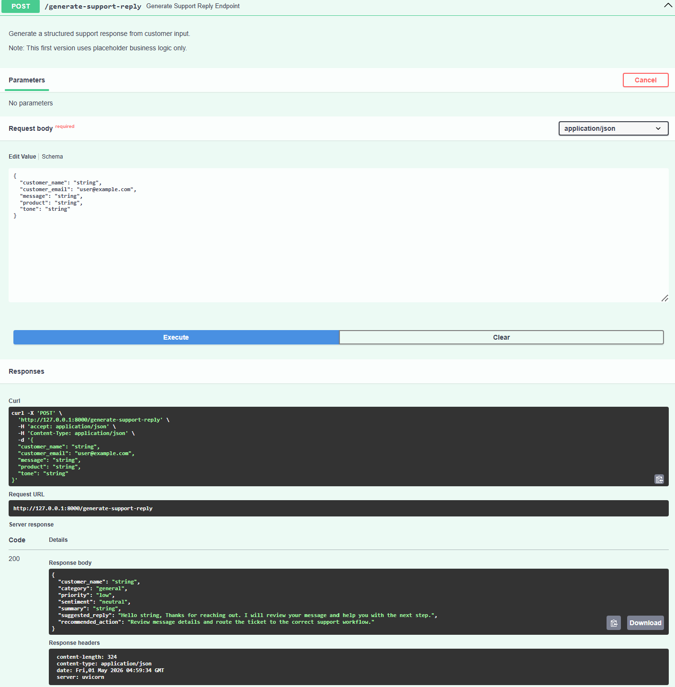

# AI Customer Support Bot (FastAPI Backend)

Portfolio project backend for transforming raw customer support messages into AI-ready structured outputs.

## Project Overview

This project provides a clean, production-oriented FastAPI API that receives a customer support request and returns structured response metadata.  
The output is designed to be consumed by future AI automation workflows, CRM integrations, and internal support tooling.

## Business Use Case

Customer support teams often receive unstructured messages that require triage before action.  
This API standardizes each message into:

- Category (for routing)
- Priority (for urgency handling)
- Sentiment (for support context)
- Summary (for quick review)
- Suggested reply (for response drafting)
- Recommended action (for operations workflow)

This helps reduce manual triage time and improves consistency in support operations.

## Tech Stack

- Python 3.10+
- FastAPI
- Pydantic
- Uvicorn

## Project Structure

```text
.
├── app/
│   ├── main.py
│   ├── schemas/
│   │   └── support_schema.py
│   └── services/
│       └── support_service.py
├── .env.example
├── .gitignore
├── requirements.txt
└── README.md
```

## Setup Instructions

1. Create and activate a virtual environment.
2. Install dependencies.
3. Run the FastAPI server.

### Windows (PowerShell)

```powershell
python -m venv .venv
.\.venv\Scripts\Activate.ps1
pip install -r requirements.txt
uvicorn app.main:app --reload
```

### Linux / macOS

```bash
python -m venv .venv
source .venv/bin/activate
pip install -r requirements.txt
uvicorn app.main:app --reload
```

Server will be available at:

- API base URL: `http://127.0.0.1:8000`
- Swagger docs: `http://127.0.0.1:8000/docs`

## API Endpoint

### POST `/generate-support-reply`

Accepts a customer support message and returns a structured support response.

### Sample Request

```json
{
  "customer_name": "Sarah Johnson",
  "customer_email": "sarah@example.com",
  "message": "Hi, I was charged twice for my subscription this month. Can you help me fix this?",
  "product": "SaaS Subscription",
  "tone": "professional"
}
```

### Sample Response

```json
{
  "customer_name": "Sarah Johnson",
  "category": "billing",
  "priority": "high",
  "sentiment": "frustrated",
  "summary": "Customer reports being charged twice for a subscription.",
  "suggested_reply": "Hi Sarah Johnson, thank you for contacting support. I am sorry for the billing issue. I will review your account details and help resolve the duplicate charge as quickly as possible.",
  "recommended_action": "Review billing history and issue a refund if duplicate charge is confirmed."
}
```

## Screenshot

The screenshot below shows a successful POST /generate-support-reply request in FastAPI Swagger UI with a 200 response.



## Current Limitations

- Uses placeholder rule-based logic (no real LLM integration yet)
- No database persistence
- No authentication/authorization
- No rate limiting
- No frontend client

## Future Improvements

- Integrate OpenAI or another LLM provider for richer response generation
- Add ticket persistence with PostgreSQL
- Add authentication and role-based access
- Add observability (structured logging + metrics)
- Add test suite (unit + integration tests)
- Add Docker and CI/CD pipeline

## Notes for Portfolio Reviewers

This first version focuses on clean API design, schema validation, and service-layer structure.  
The codebase is intentionally organized for easy extension into a full AI-enabled support platform.
